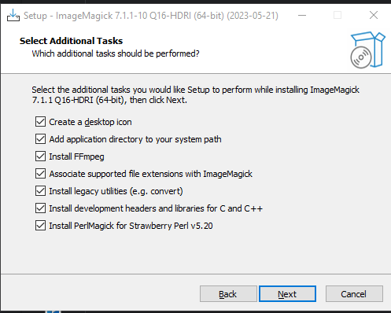

# KMM-Resize-Images
A script that allows converting a PNG image to a mobile format for [KMM](https://kotlinlang.org/lp/multiplatform/) (Kotlin Multiplatform Mobile) applications that use [Moko-Resources](https://github.com/icerockdev/moko-resources).

## Table of Contents

- [MacOS](#macos)
- [Linux](#linux)
- [Windows](#windows)

## MacOS
- Install Image Magick
```bash
  brew install imagemagick
```
- Download Repo
- Start
```sh
  sh convertImage.sh yourImage.png
```
or
```sh
  sh convertImage.sh yourImage.png yourImage2.png
```

## Linux
- Install Image Magick
```bash
  sudo apt install imagemagick
```
- Download Repo
- Start
```sh
  sh convertImage.sh yourImage.png
```
or
```sh
  sh convertImage.sh yourImage.png yourImage2.png
```

## Windows
- Install Image Magick [Install](https://imagemagick.org/script/download.php#windows)
- Install all dependencies


- Download Repo
- Allow the execution of PowerShell scripts
- Start Windows Powershell as Administrator
- Type the following command:
```sh
  set-executionpolicy unrestricted
```
- And Type the following command:
```sh
  ./convertImage.ps1 yourImage.png
```
or
```sh
  ./convertImage.ps1 yourImage.png yourImage2.png
```
